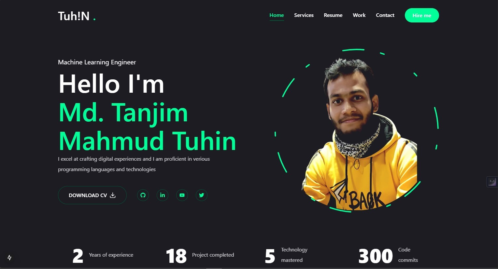

# Personal Portfolio
## Hi!! This is Muhammad tuhin Islam
Welcome to my personal portfolio! This project showcases my skills, projects, and professional background. It is built with a focus on clean design, responsive layout, and easy navigation, offering visitors a comprehensive view of my work and expertise.

## Features

- **Responsive Design**: Fully optimized for desktop and mobile devices.
- **Project Showcase**: Highlights selected projects with details on technologies, features, and links.
- **About Me Section**: Brief bio, career highlights, and areas of expertise.
- **Contact Information**: Easy-to-find links to reach out via email, LinkedIn, GitHub, etc.

## Technologies Used

- **Frontend**: HTML, CSS, JavaScript, React ( Next.js )
- **Styling**: CSS modules, Tailwind CSS 
- **Animations**: ( Framer Motion) for smooth transitions and interactivity
- **Deployment**: Deployed on (mention deployment platform, e.g., Vercel, Netlify)

